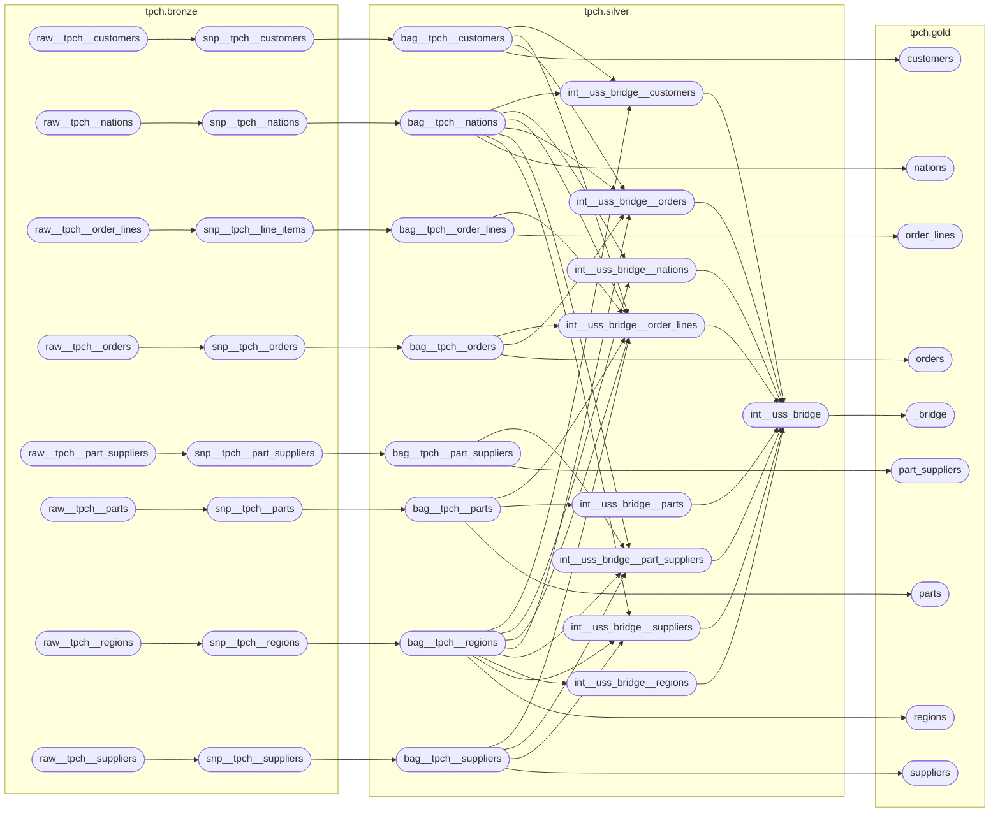
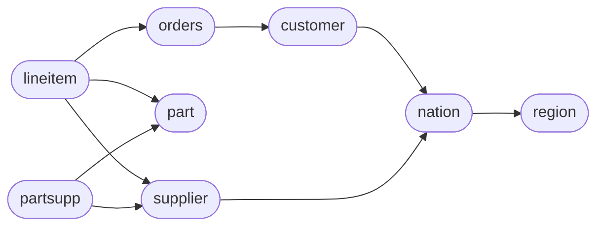
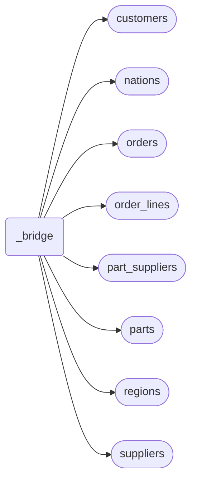

# TPC-H

## DAG / Lineage

```mermaid
flowchart LR
    subgraph tpch.bronze["tpch.bronze"]
        direction LR
        raw__tpch__customers(["raw__tpch__customers"])
        raw__tpch__nations(["raw__tpch__nations"])
        raw__tpch__order_lines(["raw__tpch__order_lines"])
        raw__tpch__orders(["raw__tpch__orders"])
        raw__tpch__part_suppliers(["raw__tpch__part_suppliers"])
        raw__tpch__parts(["raw__tpch__parts"])
        raw__tpch__regions(["raw__tpch__regions"])
        raw__tpch__suppliers(["raw__tpch__suppliers"])
        snp__tpch__customers(["snp__tpch__customers"])
        snp__tpch__line_items(["snp__tpch__line_items"])
        snp__tpch__nations(["snp__tpch__nations"])
        snp__tpch__orders(["snp__tpch__orders"])
        snp__tpch__part_suppliers(["snp__tpch__part_suppliers"])
        snp__tpch__parts(["snp__tpch__parts"])
        snp__tpch__regions(["snp__tpch__regions"])
        snp__tpch__suppliers(["snp__tpch__suppliers"])
    end

    subgraph tpch.silver["tpch.silver"]
        direction LR
        bag__tpch__customers(["bag__tpch__customers"])
        bag__tpch__nations(["bag__tpch__nations"])
        bag__tpch__order_lines(["bag__tpch__order_lines"])
        bag__tpch__orders(["bag__tpch__orders"])
        bag__tpch__part_suppliers(["bag__tpch__part_suppliers"])
        bag__tpch__parts(["bag__tpch__parts"])
        bag__tpch__regions(["bag__tpch__regions"])
        bag__tpch__suppliers(["bag__tpch__suppliers"])
        int__uss_bridge(["int__uss_bridge"])
        int__uss_bridge__customers(["int__uss_bridge__customers"])
        int__uss_bridge__nations(["int__uss_bridge__nations"])
        int__uss_bridge__order_lines(["int__uss_bridge__order_lines"])
        int__uss_bridge__orders(["int__uss_bridge__orders"])
        int__uss_bridge__part_suppliers(["int__uss_bridge__part_suppliers"])
        int__uss_bridge__parts(["int__uss_bridge__parts"])
        int__uss_bridge__regions(["int__uss_bridge__regions"])
        int__uss_bridge__suppliers(["int__uss_bridge__suppliers"])
    end

    subgraph tpch.gold["tpch.gold"]
        direction LR
        _bridge(["_bridge"])
        customers(["customers"])
        nations(["nations"])
        order_lines(["order_lines"])
        orders(["orders"])
        part_suppliers(["part_suppliers"])
        parts(["parts"])
        regions(["regions"])
        suppliers(["suppliers"])
    end

    %% tpch.bronze -> tpch.bronze
    raw__tpch__customers --> snp__tpch__customers
    raw__tpch__nations --> snp__tpch__nations
    raw__tpch__order_lines --> snp__tpch__line_items
    raw__tpch__orders --> snp__tpch__orders
    raw__tpch__part_suppliers --> snp__tpch__part_suppliers
    raw__tpch__parts --> snp__tpch__parts
    raw__tpch__regions --> snp__tpch__regions
    raw__tpch__suppliers --> snp__tpch__suppliers

    %% tpch.bronze -> tpch.silver
    snp__tpch__customers --> bag__tpch__customers
    snp__tpch__line_items --> bag__tpch__order_lines
    snp__tpch__nations --> bag__tpch__nations
    snp__tpch__orders --> bag__tpch__orders
    snp__tpch__part_suppliers --> bag__tpch__part_suppliers
    snp__tpch__parts --> bag__tpch__parts
    snp__tpch__regions --> bag__tpch__regions
    snp__tpch__suppliers --> bag__tpch__suppliers

    %% tpch.silver -> tpch.silver
    bag__tpch__customers --> int__uss_bridge__customers
    bag__tpch__customers --> int__uss_bridge__order_lines
    bag__tpch__customers --> int__uss_bridge__orders
    bag__tpch__nations --> int__uss_bridge__customers
    bag__tpch__nations --> int__uss_bridge__nations
    bag__tpch__nations --> int__uss_bridge__order_lines
    bag__tpch__nations --> int__uss_bridge__orders
    bag__tpch__nations --> int__uss_bridge__part_suppliers
    bag__tpch__nations --> int__uss_bridge__suppliers
    bag__tpch__order_lines --> int__uss_bridge__order_lines
    bag__tpch__orders --> int__uss_bridge__order_lines
    bag__tpch__orders --> int__uss_bridge__orders
    bag__tpch__part_suppliers --> int__uss_bridge__part_suppliers
    bag__tpch__parts --> int__uss_bridge__order_lines
    bag__tpch__parts --> int__uss_bridge__parts
    bag__tpch__regions --> int__uss_bridge__customers
    bag__tpch__regions --> int__uss_bridge__nations
    bag__tpch__regions --> int__uss_bridge__order_lines
    bag__tpch__regions --> int__uss_bridge__orders
    bag__tpch__regions --> int__uss_bridge__part_suppliers
    bag__tpch__regions --> int__uss_bridge__regions
    bag__tpch__regions --> int__uss_bridge__suppliers
    bag__tpch__suppliers --> int__uss_bridge__order_lines
    bag__tpch__suppliers --> int__uss_bridge__part_suppliers
    bag__tpch__suppliers --> int__uss_bridge__suppliers
    int__uss_bridge__customers --> int__uss_bridge
    int__uss_bridge__nations --> int__uss_bridge
    int__uss_bridge__order_lines --> int__uss_bridge
    int__uss_bridge__orders --> int__uss_bridge
    int__uss_bridge__part_suppliers --> int__uss_bridge
    int__uss_bridge__parts --> int__uss_bridge
    int__uss_bridge__regions --> int__uss_bridge
    int__uss_bridge__suppliers --> int__uss_bridge

    %% tpch.silver -> tpch.gold
    bag__tpch__customers --> customers
    bag__tpch__nations --> nations
    bag__tpch__order_lines --> order_lines
    bag__tpch__orders --> orders
    bag__tpch__part_suppliers --> part_suppliers
    bag__tpch__parts --> parts
    bag__tpch__regions --> regions
    bag__tpch__suppliers --> suppliers
    int__uss_bridge --> _bridge
```

## ERDs
### Bronze

```mermaid
flowchart LR
    customer(["customer"])
    lineitem(["lineitem"])
    nation(["nation"])
    orders(["orders"])
    part(["part"])
    partsupp(["partsupp"])
    region(["region"])
    supplier(["supplier"])

    lineitem --> orders
    lineitem --> part
    lineitem --> supplier
    orders --> customer
    customer --> nation
    nation --> region
    supplier --> nation
    partsupp --> part
    partsupp --> supplier
```

### Silver

```mermaid
flowchart LR
    %% Bags
    bag__tpch__customers("bag__tpch__customers")
    bag__tpch__nations("bag__tpch__nations")
    bag__tpch__order_lines("bag__tpch__order_lines")
    bag__tpch__orders("bag__tpch__orders")
    bag__tpch__part_suppliers("bag__tpch__part_suppliers")
    bag__tpch__parts("bag__tpch__parts")
    bag__tpch__regions("bag__tpch__regions")
    bag__tpch__suppliers("bag__tpch__suppliers")

    %% Hooks
    _hook__order(["_hook__order"])
    _hook__customer(["_hook__customer"])
    _hook__part(["_hook__part"])
    _hook__supplier(["_hook__supplier"])
    _hook__region(["_hook__region"])
    _hook__nation(["_hook__nation"])
    _hook__order_line(["_hook__order_line"])
    _hook__part_supplier(["_hook__part_supplier"])

    %% Relations
    _hook__order_line --> bag__tpch__order_lines

    bag__tpch__order_lines --> _hook__order
    _hook__order --> bag__tpch__orders
    bag__tpch__orders --> _hook__customer
    _hook__customer --> bag__tpch__customers
    bag__tpch__customers --> _hook__nation
    _hook__nation --> bag__tpch__nations
    bag__tpch__nations --> _hook__region
    _hook__region --> bag__tpch__regions

    bag__tpch__order_lines -->_hook__part
    _hook__part --> bag__tpch__parts

    bag__tpch__order_lines --> _hook__supplier
    _hook__supplier --> bag__tpch__suppliers
    bag__tpch__suppliers --> _hook__nation

    _hook__part_supplier --> bag__tpch__part_suppliers
    bag__tpch__part_suppliers --> _hook__supplier
    bag__tpch__part_suppliers --> _hook__part
```

### Gold

```mermaid
flowchart LR
    _bridge("_bridge")
    customers(["customers"])
    nations(["nations"])
    orders(["orders"])
    order_lines(["order_lines"])
    part_suppliers(["part_suppliers"])
    parts(["parts"])
    regions(["regions"])
    suppliers(["suppliers"])
    
    _bridge --> customers
    _bridge --> nations
    _bridge --> orders
    _bridge --> order_lines
    _bridge --> part_suppliers
    _bridge --> parts
    _bridge --> regions
    _bridge --> suppliers
```